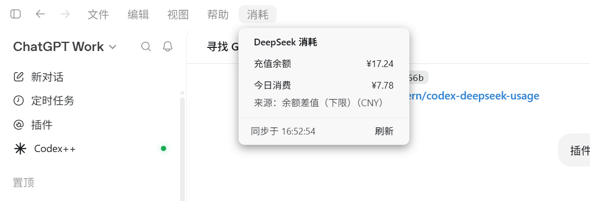

# Codex++ DeepSeek 消耗

给 Codex 桌面端顶部菜单栏加一个「消耗」按钮，随时看 DeepSeek 的**充值余额**和**今日消费**。

```
文件 | 编辑 | 视图 | 帮助 | 消耗
```



点开就是这样一张小卡片：只有两行数字、一个数据来源、一个刷新按钮。不点刷新的话每 360 秒自动同步一次。

> 官网那个「账户总额」= 充值余额 + 赠送额度。只充过值的时候两者是同一个数，摆两遍没有意义，所以没有列出来。

---

## 特性

- **只看两个数**：充值余额、今日消费，没有别的。
- **不需要单独配置密钥**：余额用 `~/.codex/auth.json` 里现有的 key；今日消费的登录态直接从 Chrome 里读。
- **随 Codex 启动、随 Codex 退出**，不随系统开机自启，不常驻托盘。
- **装在用户目录**，不碰 Codex 安装目录，卸载能还原。

## 工作原理

Codex 主进程不允许渲染进程自己发 HTTP 请求，所以整个东西分成两半：

```
┌─ Codex 窗口（渲染进程）─────────────────────┐
│  deepseek-usage-panel.js                    │
│  往菜单栏插「消耗」按钮 + 渲染小卡片          │
└───────────────▲─────────────────────────────┘
                │ 调试端口（CDP，只连本机回环）
┌───────────────┴─────────────────────────────┐
│  deepseek-usage-helper.ps1                  │
│  取余额 / 取今日消费 → 推给卡片               │
└─────────────────────────────────────────────┘
                ▲
                │ 由 Codex 作为 MCP 服务器拉起
        mcp-launcher.ps1
```

页面脚本只负责画界面，**一个字节的数据都不由它去取**；取数全部在外部助手进程里完成，通过调试端口把结果推回页面。

### 数据来源

| 指标 | 来源 | 说明 |
|---|---|---|
| 充值余额 | `https://api.deepseek.com/user/balance` | 官方接口，用 `~/.codex/auth.json` 里的 `OPENAI_API_KEY`，取 `topped_up_balance` |
| 今日消费 | `https://platform.deepseek.com/api/v0/usage/by_api_key/cost` | 就是网页版 `platform.deepseek.com/usage` 选「今日」看到的数字，按模型逐小时 cost 求和 |

「今日消费」的凭证由助手自动从 Chrome 的 `Local Storage\leveldb` 里读 `userToken`。
**只要 Chrome 登录着 DeepSeek 网页版，就不用配任何东西。**

取不到凭证时会退回「余额差值」估算（当前余额 − 当日首次采样余额 + 当日充值），卡片上会标注`来源：余额差值`。
这是估算，助手没有跑满全天时会偏小，会额外标「下限」。

### 为什么用 MCP 挂启动

Codex 桌面端没有别的「随应用启动」扩展点：启动文件夹是随系统开机，不符合要求；而 MCP 服务器正好是
Codex 启动时拉起、退出时回收的。

所以安装脚本在 `~/.codex/config.toml` 里写一小段 `[mcp_servers.deepseek_usage]` 指向 `mcp-launcher.ps1`。
这个启动器只干一件事：**Codex 起来 → 拉起助手；Codex 退出 → 关掉助手**。
顺带它还暴露一个 `deepseek_usage` 工具，让 Codex 自己也能读到那份数据。

## 环境要求

- Windows 10 / 11
- [Codex 桌面端](https://openai.com/codex)（本插件依赖它的调试端口和用户脚本机制）
- [Codex++](https://github.com/BigPizzaV3/CodexPlusPlus)（把用户脚本注入 Codex 的启动器）
- 已登录 DeepSeek 网页版的 Chrome（只为「今日消费」这一项）

## 安装

```powershell
powershell -NoProfile -ExecutionPolicy Bypass -File .\install.ps1
```

装完**重启一次 Codex**，然后点顶部菜单栏的「消耗」。

脚本会备份改过的文件（`config.toml.dsusage.bak`、`user_scripts.json.bak`），重复运行不会重复写入。

## 卸载

```powershell
powershell -NoProfile -ExecutionPolicy Bypass -File .\uninstall.ps1
```

会停掉助手、移除启动文件夹里的旧快捷方式、从 `config.toml` 摘掉 MCP 注册，并删除插件文件。
重启 Codex 后「消耗」按钮消失。

## 配置

`%APPDATA%\Codex++\deepseek-usage\config.json`

| 字段 | 默认 | 说明 |
|---|---|---|
| `debugPort` | `9229` | Codex++ 启动 Codex 时带的调试端口 |
| `refreshSeconds` | `360` | 自动刷新间隔（秒） |
| `pollSeconds` | `2` | 助手轮询页面的间隔（秒） |
| `apiKey` | 空 | 留空则读 `~/.codex/auth.json` 的 `OPENAI_API_KEY` |
| `platformToken` | 空 | 留空则自动从 Chrome 读取 |
| `uiScript` | 空 | 一般不用填 |

## 排查

日志：

- 助手：`%APPDATA%\Codex++\deepseek-usage\helper.log`
- 启动器：`%APPDATA%\Codex++\deepseek-usage\launcher.log`

常见情况：

| 现象 | 原因 / 处理 |
|---|---|
| 卡片显示「等待助手进程…」 | 助手没在跑。看 `launcher.log` 有没有 `spawned`；也可以双击 `%APPDATA%\Codex++\deepseek-usage\start-hidden.vbs` 手动拉起 |
| 「获取失败：未找到 DeepSeek API Key」 | `~/.codex/auth.json` 里没有 `OPENAI_API_KEY`，或在 `config.json` 里填 `apiKey` |
| 「今日消费」变成余额差值 | Chrome 里 DeepSeek 网页版登录失效了，重新登录即可 |
| 重启 Codex 后助手没被带起来 | 多半是 Codex 重写 `~/.codex/config.toml` 时把 `[mcp_servers.deepseek_usage]` 抹掉了，重跑一次 `install.ps1` 补写 |

## 已知限制

- 「今日消费」走的是网页版内部接口（不是公开 API），**DeepSeek 改版时可能失效**，届时会退回余额差值估算。
- 助手每 2 秒连一次本地调试端口，属于轻量轮询。
- 「今日」按北京时间算，跨时区使用需要自行调整。
- 只在 Windows 上验证过。

## 目录结构

```
deepseek-usage-panel.js        注入 Codex 页面的用户脚本（菜单栏按钮 + 卡片）
config.example.json            默认配置
install.ps1 / uninstall.ps1    安装 / 卸载
helper/
  deepseek-usage-helper.ps1    取数并推给页面
  mcp-launcher.ps1             随 Codex 启动，拉起 / 回收助手
  start-hidden.vbs             无窗口启动助手（调试用）
docs/
  screenshot.png
```

## 许可

[MIT](LICENSE)

## 免责声明

非官方项目，与 OpenAI、DeepSeek 均无关联。使用「今日消费」所依赖的网页版内部接口可能违反其服务条款，
请自行判断。本项目只读取你自己的账户数据，不发送到任何第三方。